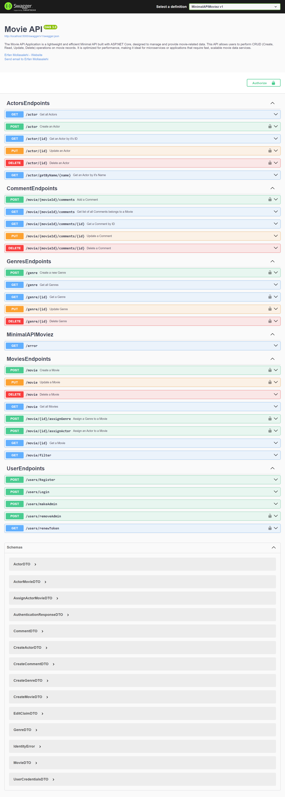

# Movie API

A backend-focused **Movie API** built with **ASP.NET Core Minimal APIs** to practice and demonstrate practical backend development skills such as API design, authentication, authorization, validation, data access, caching, and API documentation.

This project was created as a learning-focused portfolio project and is intended to showcase hands-on .NET backend development.

## Overview

The API provides functionality for managing:

- Movies
- Genres
- Actors
- Comments
- User accounts and authentication

It also includes support for:

- JWT-based authentication
- Role-based authorization
- FluentValidation
- Swagger / OpenAPI
- Redis output caching
- Azure Blob Storage
- A simple GraphQL add-on

## Swagger Preview



## Features

- Built with **ASP.NET Core Minimal APIs**
- **Entity Framework Core** with **SQL Server**
- **ASP.NET Identity** for user management
- **JWT Bearer Authentication**
- **Role-based authorization**
- CRUD operations for movies, actors, genres, and comments
- Movie filtering support
- Genre and actor assignment to movies
- **FluentValidation** for request validation
- **AutoMapper** for DTO-to-entity mapping
- **Swagger / OpenAPI** for API exploration and testing
- **Redis output caching**
- **Azure Blob Storage** for file handling
- Simple **GraphQL** support as an additional feature

## Tech Stack

- ASP.NET Core
- C#
- Minimal APIs
- Entity Framework Core
- SQL Server
- ASP.NET Identity
- JWT Authentication
- FluentValidation
- AutoMapper
- Swagger / OpenAPI
- Redis
- Azure Blob Storage
- GraphQL

## Main Endpoints

### Users
- `POST /users/Register`
- `POST /users/Login`
- `POST /users/makeAdmin`
- `POST /users/removeAdmin`
- `GET /users/renewToken`

### Movies
- `GET /movie`
- `GET /movie/{id}`
- `GET /movie/filter`
- `POST /movie`
- `PUT /movie`
- `DELETE /movie`
- `POST /movie/{id}/assignGenre`
- `POST /movie/{id}/assignActor`

### Actors
- `GET /actor`
- `GET /actor/{id}`
- `GET /actor/getByName/{name}`
- `POST /actor`
- `PUT /actor/{id}`
- `DELETE /actor/{id}`

### Genres
- `GET /genre`
- `GET /genre/{id}`
- `POST /genre`
- `PUT /genre/{id}`
- `DELETE /genre/{id}`

### Comments
- `POST /movie/{movieId}/comments`
- `GET /movie/{movieId}/comments`
- `GET /movie/{movieId}/comments/{id}`
- `PUT /movie/{movieId}/comments/{id}`
- `DELETE /movie/{movieId}/comments/{id}`

## Project Structure

```text
MinimalAPI/
├── EndPoints/        # Minimal API route definitions
├── DTOs/             # Request and response models
├── Entities/         # Domain entities
├── Repositories/     # Data access layer
├── Services/         # Supporting services and infrastructure logic
├── Validations/      # FluentValidation validators
├── Filters/          # Endpoint filters
├── GraphQL/          # GraphQL add-on
├── Migrations/       # EF Core migrations
├── Utilities/        # Helper classes and extensions
└── Program.cs        # Application bootstrap
